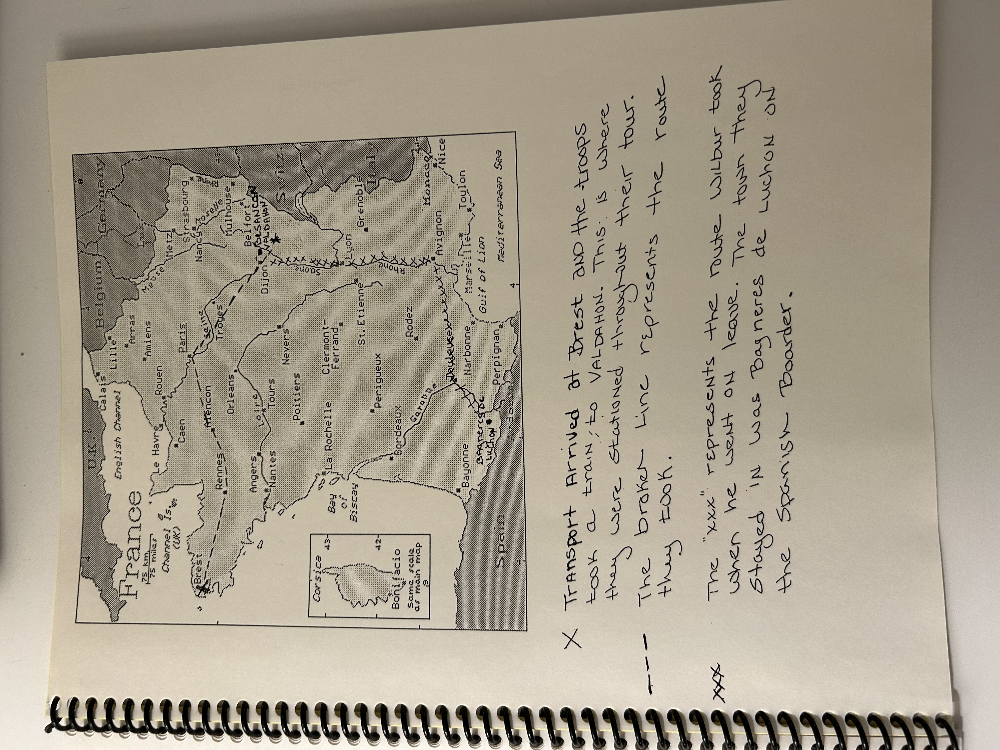

# Wilbur Atkinson's journal from his trip to France

## August 1918

> This has been transcribed from Nancy Jones's
> transcription.  Nancy turned it from paper hand-written journal to
> typed-on-paper.  And I'm turning it from typed-on-paper to digitalized.
>
> Jesse Atkinson (Wilbur Atkinson's great grandson)

> Wilbur Atkinson's diary was written in an old school note book.  I have typed
> it out for all of the children, grandchildren and great grandchildren to share.
> I have left the spelling and punctuation alone in almost all cases.  I only
> edited the punctuation when it made it easier to understand the sequence of
> events.  I have also included a map of France to indicate where he was stationed
> and the route he took on his trip to the mountains.
>
> Nancy Jones (Wilbur Atkinson's granddaughter)

### My Trip to France

We left Camp Beaugard at 1045 a.m. on the 14 of August.  We had pullman cars
for the trip.  We stopped in the switch yards of Shreivesport LA. while the red
cross gave us refreshments and tabacco.  Our next stop was Jonesbourough Ark.
where we detrained and took exercise.  The next time we left the train was at
Decatur Ill. where we had a good bath and sweets from the red cross again.  We
went through Laffette Ind.  Late in the evening we crossed into Canada at
Detroit Mich.  About 3 o'clock in the morning I woke up cold and looked out of
the window.  The first thing I saw was a Canadian Solider.  We traveled until
day light along lake St Clair.  We got off at St Thomas.  We could notice the
difference in the country and people and we missed the Red Cross.  We took a
hike over the city.  We saw a company of negroes there.  Our next stop was at
Niagra where we hiked out to the falls. We crossed the Niagra river over into
the states.  We were glad to get back into the U.S. even if we were not out of
it over 12 hours.  Our next stop of any importance was at Mauchchunk Pa.  We
did not get off the train.  This is a very interesting town being a summer
resort there was a good many people there.  The town is located on two ridges
with the Le High river running between.  We followed the Le High river as it
wound its way down the mountain.  The rial road was first on one side then on
the other. We could look out of one side of the car down upon swift running
water and out of the other side we could not see the top of the mountain and
part of the time not even the sky.  The same day we went past the Betheleham
steel works here we was welcomed by whistles of all tones and they was held
down as long as we were within hearing.  We arrived in the New York Station at
about 3:15 p.m. on the 18th of August.  Here we loaded on a small steamer which
carried us over to Long Island.  We passed pretty close to the Statute of
Liberty and saw the tallest building in New York on Long Island.  We were put
on steel passanger cars which had Long Island along the top in large letters.
We saw some fine country on our way to camp.  We arrived at camp about 7:30
p.m.  Our first night in Camp was a little cool for we had only one blanket and
it gets pretty cool at night in August on Long Island.

We were wearing campagn hats and canvas leggings while all the other
organizations were wearing over sea caps and spirral leggings.  We felt a
little out of place until we were issued them.  I did not get to go to rockaway
beach or New York while we were there on account of not having the money.
There was air planes in the air all day doing all kins of stunts.  I saw
several hydroplanes flying over.  On the evening of the 27 of August we were
given orders to role our packs and get read y to move.  It was generaly thought
that we were going to Camp Merrit which is just over in New Jersey.  That night
we sleeped on bare springs.  A while before the day light we fell out with
packs was counted off given squads right and marched off down the road.  We
loaded on cars at day break and taken to the same station that we come through
when we come over.  We were loaded on a small steamer which started down the
Hudson.  We passed the entrence of the harbor then we come in sight of the U.S.
transport piers.  We knew then where we were going.  Then we come in sight of a
large three funnel (a metal chimney on a steam ship) ship and we were much
suprised and pleased when we were loaded on it.  It was the Levienthian of the
Fatherland the largest ship afloat.  We loaded on about 1:00 p.m.  About 3:00
p.m. a guard list was called off and I was one of them.  I go ta post on the
same deck as the battery was guarding a water tite door.  We were on 4 hours
and off 8.  So I got the morning on deck.  We sailed at 1 p.m. on 31st of
August.  There were two other transports with us the Great Northern and the
Northern Pacific.  There were two or three bands on the pier playing as we
pulled out by tugs.  I was on guard while we were going out of the harbor and
when I came on deck at 4 O'clock I could just see a little fringe of land off
to the left.  I saw my first flying fish that evening while looking over the
rail at the water.  There was four submarines destroyers with us that evening.
The next morning I went on deck and there was the same things just as there was
the night before except the land. Then the ships begin a zigzag course.  The
boat began to rock and role and we began to get light headed.  And sometimes it
would seem as though I was walking up hill and then I would start down another.
I would start down stairs to another deck and it would seem as though the
stairs were coming up to meet me. The next morning the destroyers had
disappeared and we were alone with the other two transports.  We went on until
two days out of port we were met by a convoy. I had started to climb up to my
bunk when one of the destroyers dropped a depth bomb which shook the boat so
that I almost lost my hold.  We sighted land a little while after dinner and
arrived in the harbor of Breast at about 5 pm.m on the 7th of September.

The ship was so large tht they culd not get it up to the piers and had to
anchor it out in the harbor.  We did not get off until about 5:30 on the
evening of the 8th of Sept.  Then we loaded on another little steamer and was
taken ashore.  We were started on our hike to the rest camp.  We hadn't started
until it begin to rain and it rained on us all the way to camp which was about
3 miles.  We had to pitch our pup tents that night.  We finally got to bed
about 11:00.  The next morning I was woke up by some one running over my tent
and broke the rear tent pole and steppe don my bunkies face.  It had stopped
raining but not for long. We were wondering where they got sunny France out of
that.  This was a rest camp.  But we had plenty of work buildings ware houses
and unloading boats.  We were sure glad to leave there which we did on Sunday
the 15th of Sept.  It happended to be a nice sunny day.  We loaded on box cars
which were marked on the side 40 hommes or 8 cheaveaux which means 40 men or 8
horses.  There was 40 men in the car I wa sin and it filled it full.  We left
Breast about 7.pm. for our ride across France.  That night we did not sleep
much because we could not lay down on teh floor .  The next morning we unloaded
about 9 o'clock at Messac. We hiked over to Bain about 9 Kilomters (6 miles).
We were pretty well played out when we arrived there late in the evening.  we
were billeted inn lofts of barns and got a good nights sleeep.  we had a cold
supper the night that we arrived in Bain but we ate like hungry dogs.  The only
time I really saw soldiers eat their corn willie with such an appitite.  We
hadn't had anything to eat for 24 hours.  I was promoted to corporal while we
were here.  We drilled every day and went through all kinds of setting up
exercises.  We had two new Lieutants and they put us in the best physical shape
that we have ever been in by double timing us until we were out of breath and
then putting us through all kind of movements standing until we were ready to
double time some more. we stayed here until the 27th of Sept. I was sent on the
26th with a detail of 15 men to Messac for the purpose of loading supplys for
the Brigade. I stayed here for 10 days. we were billeted in a barn of a large
chateau. We had an easy time. We were working about half of the time. Messac is
on the main rail rod between Rennes and St Magaine. The French soldiers stopped
here on their leaves. On the 7th of Oct. we loaded on a passanger train and
went over to camp Coetquidan and I joined my organization. I started to a
signal (telephone) school. We fired the first time on the range here on the
15th of Oct. We only fired one gun. We fired every few days until the 5th of
Nov. Then we begin the Brigade problem which lasted until the evening of the
6th. I was in the telephone dugout just behind the gun. And the night of the
5th when the first shot went off, it blew out our candle and left us in the
dark. While doing all the firing on the range, we had to carry our wire out
there by hand which was very heavy. On the 11th when the armists was signed we
were out on the range firing but were to busy to realize what had happened. On
the 16th of Nov. we started for Valdahon as a school of fire. The first Btn was
the only one. We passed through Rennes and Paris and Dijon. It was so cold that
one of the boys in my car got off when they stopped and got a bucket and we
built a fire in it and had a pretty good fire. It was a little smoky but it
helped. We arrived at Valdahon about 8p.m. on the 19th of Nov. It was cold and
the ground froze but clear and the stars shining. The 140th was already here
and they halled our equipment up to camp. We did not do anything but a little
drilling through the rest of Nov. We had a big Christmas dinner. Col. Owneby
and the rest of our officers ate dinner with us. Then they had a Christmas tree
at the Y.M.C.A. We did not do but very little in Jan and on the 10th of Jan., I
started my 7 day leave. Left Besancon at 11:15 p.m. on the 10th of Jan arrived
at Dijon at 1:30. Left Dijon at 3:22 arrived in Lyon at 8:30 a.m. Arrived in
Avignon at 1:30 p.m. arrived in Tarascon at 2:00 o'clock left Tarascon at 3:30
p.m. arrived at Nimes about 5 o'clock went through Montpellier arrived in
Toulouse at 3:15 a.m. Our leave call for Toulouse but it was not a leave area
and they would not let us stay there. So they sent us down on the Spanish
bordor. Left Toulouse at 5:50 p.m. arrived in Montrejeau at 11 p.m. got rooms
and went to bed. Left there at 9:30 a.m. 14 Jan. arrived in Bagneres De Luchon
at 10:40 a.m. got lodging at the Hotel Masons Bonnette. This is where we stayed
on our leave. Wensday we went on a hike up the side of the mountain to any old
church. Read at Y.M.C.A. that evening. Went on a skiing party Thursday, Friday
Saturday and Sunday was spent in the Y. Monday evening I hiked to the Spanish
Bordor Tuesday evening we spent skiing. We started back at 7:10 Wensday morning
passed through Montrejeau, Toulouse and stopped over nite in Cette. Left there
at 4:50 Thursday morning. Went through Montpillier and Nimes and changed cars
at Tarascon. Changed again at Avignon for Lyon. Changed trains at Dijon.
Arrived in Besancon at 8:30 p.m. Left Besancon the next evening at 5:15.
Saturday arrived in Valdahon at about 8 p.m. thus completing getting back to
camp on the 25th of Jan.

We started the first school of fire on the 4th of Feb. This school lasted until
25th. Our next school began on the 6th of March. One of the French 75 blew up
during this school and killed three of the crew. This school closed on the
26th. The weather was very bad through both of these schools. A quad truck
could not get off the road without miring and would have to be pulled out by
the tractors which would seldom mire down. They might half bury themselves in
the mud but they would most generally find solid ground and pull out. April 7th
the instructors calibrated the guns of "A". Battery No. 3 gun was in the repair
shop. They fired 92 rounds and run our of ammunition at 10 O'clock. It was a
fine day it look as if spring has come. Thursday, April 10th, the third school
began today. I am recording at the battery. It is pretty cold and my hand gets
so cold that I can hardly write. Walter is operating at the B.C. The officer
that picked the battery position made a mistake and put the battery in the rong
area. We did not fire that evening. We went out Friday morning. It was raining.
We wore our steel helmets, rain coats, and rubber boats. The position was area
1 and in a mud hole. The minimum elevation was 370 on No. 3 gun and it was out
most of the time. The reel cart gears hangs and they have to leave the wire out
there. It was so foggy that they had to stop firing at 10 O'clock. We did not
go out that evening. Everybody had to spend the evening in making a general
clean up. The gun crews tractor truck and car drivers had to wash all the mud
off of there vehicle. Saturday morning Capt. Willis of B battery inspected us
and our equipment. While Capt. Brogdon inspected Battery B. We had the evening
off and I spent it in reading the "Hertage of the Desert." Sunday Morning the
reconessence car left at 5 O'clock for the front with the sergents. At 8:30 5
trucks left loaded with men for a joy ride. They got back at 4:00 O'clock. It
was cloudy all day and started misting rain at 4 O'clock. Monday morning we
fired all morning it was a nice day. A Frenchman took a picture of the battery
just as it fired a round. We did not fire that evening. Tuesday morning we did
not fire but fired that evening. Colland of Battery B was the executive all of
our officers being at a trial. It took turns at raining, snowing, and clearing
off all day. We did not fire at all Wednsday. I spent all morning reading it
was a pretty nice day but cloudy all day.

Thursday morning, it started in snowing. we went out to the range but the
officers did not come out. So we stayed till 10 O'clock. They left the guns out
there and came in. In the evening the drivers went out and brought them in.
Friday was a fine day but a little cold. In the morning, they had to pull no 2
gun into Battery with a tractor. We fired 216 shots in the morning. The most we
have fired in a half day with only 3 guns. In the evening we fired about 150
shots. Saturday morning the 142, 140 and 52 infantry took part in a ceremony
rewarding an American soldier with the Croix de Guerre. The evening was spent
in cleaning up for inspection. Sunday morning we laid out our equipment for
general inspection. But the general did not come. So we put our equipment up
about the middle of the evening. was a fine day.

Monday morning we did not fire. But we fired in the evening. It was a fine day.
Tuesday we fired all day. The sun shone all day. Wednsday we only fired in the
evening. It was clear all day but pretty cold.

Thurday morning we fired 273 rounds which is our record for a half day so far. In the
evening we fired 245 which makes our record for all days firing. It snowed and mist
rain all day. We had all four guns in the battery.
Friday morning we started to the range but had to come back on account of the fog and
snow falling. In the evening we fired 233 rounds. It was cloudy all evening but did not
rain or snow.
Saturday morning we had inspection but it was not a very hard one. Saturday evening I
went to the range where the targets are. I found several 155 shell laying there that had
not exploded, a few F.A. shells with 2 A.L. fuses in them, and a good many C.A. with
S.R. fuses. I saw several 75 high exlosives that had not exploded and picked up an
American and French time fuse.
Sunday, it was bad all day.
Monday morning it snowed so hard that we could hardly see a hundred yards. but in
the evening we fired until 3:30 and it snowed us out. We only fired 100 shots
Tuesday it snowed so hard that we did not go to the range at all.
Wednsday we went to the range and stayed all day. Although it snowed all the time.
They had four of the tractors mired down in the mud at one time. It took three tractors
to pull no. 1 gun into position, and we fired only 8 rounds. About 2 O'clock, we had
good news while we were out there. The captain come out about noon and told some
of the boys tht there was a telegram in Camp notifying us to get ready to leave for the
states. This is the last day of the school and the last day of April.

May 1st we turned in all of our telephone equipment today and white washed the walls
and ceiling of our room. It has been raining all day.
May 2 they are still white washing the wall. We are preparing to turn in all of our
equipment. It is a pretty good day for France, more rain and snow.
May 3 we had an inspection in the morning but did not have anything to do in the
evening. There are some about us leaving this camp next week for the port of
embarcation.
More rain.
May 4 Sunday it is still raining. I have a pass and went to Valdahon this morning and
got a dinner of pork chops and eggs.
May 5 we are turning in all our extra equipment including boots, our shoes one blanket
and leather gloves. The talk is now we leave the last of this week.
May 6 we did not do anything but paint the halls and rooms. The cars have not come
yet to load the guns and the tractors. It is a fine day.
May 8 It is still fine weather. we drilled this morning for the first time for over a month. I
go on guard at 4 O'clock. Walter is on with me. It is not a hard guard only 3 corporals
and 9 privates.
May 9 we had an inspection and check of our property this morning. The battery drilled
in the evening. Saturday May 10 we had a regular saturday morning inspection this
morning. It has been raining a little all day. Saturday night they brought 1st Seargant
Bingham up to the barracks. He had been hit in the side of the head. The doctor said
it was a shot.
Sunday May 11 it is nice today if it is a little cloudy. I come off of guard this evening.
Wensday May 14 it has been a nice day. We have been having inspections and
drilling every day. I was in charge of quarters today. We haven't any of our stuff
loaded yet but expect to load it in a few days.
Thursday May 15 It has been another fine day after small rain the night before. We
drilled about 3 hours today and drill 1 hour with packs. The 140 F.A. left for the port of
embarcation this evening. We think they are going to Marsailles. They had 30 cars in
the train
Sunday May 18 they finished loading our guns and tractors today. It has been raining
a little all day.
Wensday May 21 st we have been drilling 3 hours a day and one hour with packs. This
evening we took down our beds and scrubbed the floors. we are leaving at 6 O'clock in
the morning. The cars are on the track now waiting for us.
Thursday May 22 we left Valdahon at 7:10 a.m. towed behind a passanger train layed
over in Besancon 4 hours and left there at 12:30, We are travelling very slow. we
"
layed over in Dole for about 4 hours. we left there at 7:15 p.m.
Friday May 23 we are almost to Never this morning and making better time. We have
an American train crew. There are 7 of us in a second class compartment. We have
passed through baurges. We stopped at Villefranche and got coffee and took exercise.
We stopped at Gievers at 4:30 p.m. There are six troop trains here. The Texas and
Oklahoma six division and one of casuals and one of the wild cat div
We saw Lt. Barr here. He used to be a Sgt in Battery A.
Saturday, May 24, we passed through Angers just after day break. We are traveling
faster this morning. we have our rations in the car with us. They consist of hard tack
rost beef or "cornwillis" jam pork and beans and milk. We got into Nantes at 10:30 a.m
left there at
We arrived in Camp at 3:30. we are in long wooden barracks with bunks two high. We
joined the rest of the Regiment here. We are expecting to embark in a few days. The
rest of the Regiment is ready to go.
Sunday, May 25, spent a good nights sleep last night. We are cleaning up our
equipment this morning. We ate breakfast in a large mess hall this morning. Where
they feed over 5,000 soldiers three times a day and feed them pretty good.
8 O'clock we cleaned all our equipment today and had inspection and check. Weather
is very nice here very much warmer than at Valdahon. We are turning in our barracks
bags to be sent to the states.
Monday May 26th we had our physical inspection this morning. We all passed alright
as far as I know. Now it was not a very hard one. we are still cleaning up and getting
ready for the big inspection. This is another nice day. They stearalized our blankets
this evening and had an inspection or our equipment at 6:30 p.m. Tuesday May 27, we
had our inspection of pack this morning by Col Owenby. We had a show down
inspection at 1:00 O'clock by Col. Owenby. Then we had 30 minutes of foot drill. We
are to have the big final inspection tomorrow. Wensday May 28th we stood our big
final inspection this morning. There was only two loose belts in the pack inspection
and one dirty cup and one sock short. We passed so good an inspection that we were
not required to drill before the inspectors. They have the fellow that had the dirty cup
out policing up around the barracks now. He will sure have a hard time now until he
gets out. We are not doing anything this evening. I saw Carl Ford this evenng he has
been here in camp Guthrie for six months guarding German prisoners. It is still nice
weather here.
Thursday May 29 we had 1/2 hour setting up exercises and 2 hours of good drill. I
went to a ball game this evening played between 1st and 2nd battalions. The score
was 3 to 4 in favor or the 2nd. The boys are all getting in a hurry to leave this camp.
when we do, we will go to camp no. 1 or aboard ship.
Friday May 30 this is decoration day and we have a holiday. We went to a speaking
this morning. Dr Cosbern an officer in the red cross spoke to us. It is cloudy and it
may begin raining any time.
Saturday May 31 We had a regular Saturday morning inspection this moring. We did
not do anything in the evening.
Sunday June 1 this is another nice day. I have been reading all day. There is no place
to go. There are rumors that we leave tomorrow. I certainly hope that we do. This is
the worst camp I have been in yet over in France - except Breast.
Monday June 2nd This has been a fine day. We had our pack for pack inspection this
morning and had a little drill. I went to a ball game this evening. Lt. Allen has just
notified us that we leave this camp some time tomorrow morning.
Tuesday June 3rd We left camp at 7:30 this morning. The hauled our packs for us.
We loaded on the boat at 10:30 a.m. Our boat is the USS Amphion. They say it is a
German vessel and that this is the first trip it has made with troops. We were placed in
the bow. It has one funnel. The tugs started to turn us around at 4:45 p.m. Sailed out
of harbor at 6:15 p.m. we are almost out of sight of land now at 9:00 p.m.
Wensday June 4 | had a good nights sleep last night. The boat is rocking a good deal
and several of the boys are very sick. We have sighted several ships today.
Friday June 6th yesterday was a fine day. We had travelled 492 miles yesterday at
noon. It is rough and terribly windy. This morning some of the waves are coming over
the bow of the boat and getting several of the fellows wet. We are allowed to stay on
deck all day. I haven't been sick yet but get pretty light headed at times. The sea was
pretty rough about noon. The waves were coming over so much that we could hardly
stay up there. Then it began raining and the sea quieted down and now the sun is
shining.
Saturday June 7 it has been pretty rough today and getting rougher and the ship has
started to roll now as well as pitch. We sighted another vessel today. It was going the
other way.
Sunday June 8th the sea is calmer this mornng but the boat is still rolling. Battery A
puts on a guard this evening.
Monday June 9th, It is cloudy today and the sea is getting quieter. At noon, we had
made 1502 miles since leaving port.
Tuesday June 10th the sea is a little rougher today. The wind is blowing from the east.
We have made 1814 miles today at noon. That is not much of a week run. we made
312 miles in the last 24 hours. The boat is rolling as much as it ever has tonight.
Wensday June 11 the sea is still rough today but the sun is shining. we are 1249 miles
from Newport News making 300 miles in the last 24 hours. We have sighted several
other ships today going both ways.
Thursday June 12th the sea is calmer today and the sun is shining. We have passed
two boat loads of soldiers going to France. we were 980 miles fom Newport News
today at noon. We had boat drill again today and have been having music every day
by our band.
Saturday June 14 we were 418 miles from port today. The sea is rough and it has been
raining all morning.
Sunday June 15th Battery A is on guard today. It is clear this morning. But is clouding
up now. We have sighted several ships. We are 152 miles from port now and are
looking to sight land before dark.
Monday June 16th we anchored last night at 12:30 outside the harbor give some of the
boys a good scare when they lowered the anchor. They raised the anchor at 5:30 this
morning. We sighted land at 7:30 am entered the harbor at 9:00 and docked at 10a.m.
debarked at 10:30. We marched through the streets of Newport News. The people
shure gave us a welcome. We could not help but compare our landing here with our
landing in France. We hiked about 4 miles out to our camp which is the best I have
been in so far.
Thursday June 19 we went to a reception in town last night given by the war camp
community service.
we loaded on the train at 9:30. Started at 10 a.m. We went through Richmond VA and
passed through Raleigh N.C. at 7:30 p.m. We are on the Sea Board air line now.
Tuesday June 17th we went through the mill here this morning and received two cotton
uniforms. It is awful hot here.
Friday June 20
I had a fine night sleep last night. This sure beats traveling in France. We passed
through Monroe S.C. at sun rise. we stopped in Atlanta GA from 6 to 6:30 p.m.
Saturday June 21 st we stopped in Memphis Tenn. this evening and had a good shower
bath and a swim in the Y.M.C.A. pool.
Sunday June 22nd
We arrived in Little Rock at about 5:30 a.m. They pulled us right out to Camp Pike.

